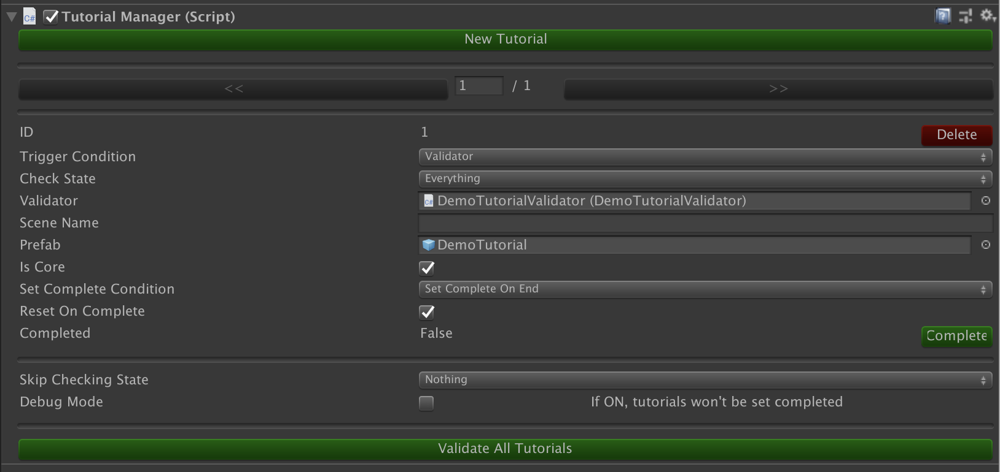
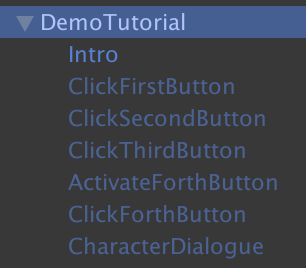
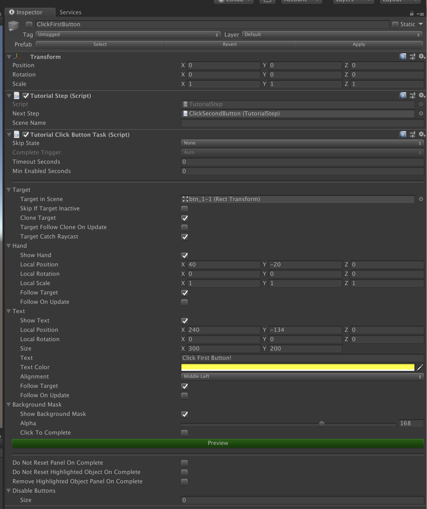

# SweatyChair Tutorial Manager

## About
A tutorial manager system used in Unity3D games, with the aim to be used across all different games withou coding or with minimal coding. This is been used in [No Humanity](http://www.sweatychair.com/no-humanity), [3DTD: Chicka Invasion](http://www.sweatychair.com/3dtd) and [Friends Must Dungeon](http://www.sweatychair.com/friends-must-dungeon).

## Scripts Overview
The tutorial system mainly consists of 5 core scripts:
- [**TutorialManager**](Assets/SweatyChair/Tutorials/Scripts/TutorialManager.cs): A persistent instance that appears in all scenes, used to create and configure tutorials in Editor. Put this in the first scene.
- [**TutorialValidator**](Assets/SweatyChair/Tutorials/Scripts/TutorialValidator.cs): A base class that check if the conditions are satisfied to trigger (show) a tutorial. Customized validator  should be inherited from this class and implement its own logics. Each tutorial should have 1 or none (if manually trigger) TutorialValidator. All validators are check once per second, so avoid putting too complianted login in `IsValidated()` for performance.
- [**TutorialStep**](Assets/SweatyChair/Tutorials/Scripts/TutorialStep.cs): A controller to keep track of each step of a tutorial. Each tutorial must have at least 1 step.
- [**TutorialTask**](Assets/SweatyChair/Tutorials/Scripts/TutorialTask.cs): A base class to tell what a tutorial task should do. Each tutorial step has 1 or more tasks (in most case 1 step has 1 task). For example, a tutorial step can have 2 tasks: instantiate a button, and go to next step if the button is clicked. Children task classes include show a text on screen, ask to click a button, spawn a GameObject in game, etc. Customized task should be inherited from this class and implement its own logics.
- [**TutorialPanel**](Assets/SweatyChair/Tutorials/Scripts/TutorialPanel.cs): An UI panel to show tutorial text, character, etc. This is only Unity UI compatiable and should be on the topest sorting order.

## Settings

Settings of each tutorial:
- **ID**: An ID to save the progress in PlayerPrefs. When the game is released, always add tutorial to the end (largest ID), so the progress of each tutorial won't be messed up.
- **Trigger Condition**: How the tutorial is triggered (start).
   * Always Trigger: Always trigger the tutorial no matter what, you should only use this with specific Check State.
   * Manuual: Only trigger mannualy, by calling `TutorialManager.StartTutorial(id)`.
   * Validator: Only trigger when a custom validator script `IsValidated()` is `true`. Use this for if you want the tutorial to trigger only under some complicated condition, e.g. players who played 15 games but never buy any item.
- **Validator**: Reference to the validator script if trigger condition is validator, leaving empty will make trigger condition as mannual.
- **Scene Name**: Only trigger the tutorial in particular scene, leaving empty will ignore this check.
- **Prefab**: The prefab that contain all tutorial steps and the actually how the tutorial shows to players.
- **Is Core**: A trivial bool just saying if this tutorial core, so in some games it can display how many core tutorials completed.
- **Set Complete Condition**: How the tutorial set as completed in PlayerPrefs, a completed tutorial will never show again. Difference between "Set On Start" and "Set on End" is that when player quit the game in the middle of the tutorial, the former won't start again and the latter will, after the players re-launch the game. "Do Not Set Complete" is used for repeating tutorial, e.g. a tutorial that always trigger when player enter level 2.
- **Reset On Complete**: After a tutorial complete, the tutorial manager should reset the state and trying to trigger the next one. You can turn this off if you don't want this behaviour and want to control this mannually using `TutorialManager.currentTutorial.Reset()`.

Global settings of tutorial manager: 
- Skip Checking State: If validator is used, it checks the condition every seconds. You can limit the state here to skip checking at some states.
- Debug Mode: Turning on a rich logging mode for debug.

## Prefabs and Steps

A tutorial prefab contains a number of children GameObject, each child is correspond to a tutorial step. The first child should be active and the reset should be inactive, because the each tutorial step simply execute its logic on `Start()`.

Each tutorial step GameObject should contains **ONE** TutorialStep, plus 1 or more TutorialTask. E.g. a step can have two tasks: instantiate an ememy and show a tutorial hand on top of it. A step is considered to be completed only when all tasks completed.
You can also attach your custom script into the step GameObject for you own need. E.g. script just to open coin shop at `OnEnable()`.
TutorialStep settings:
- **Next Step**: Reference to next TutorialStep. The next step will be trigger once this step completed. If no next step set, then this step is the last step, completing it will completing the tutorial.
- **Scene Name**: When set, only executes this step if current scene matched, otherwise this step is skipped and proceed to the next. Leaving empty will ignore this check.
TutorialTask shared  settings:
- **Skip State**: Skip execute this task and set as completed, if the state match.
- **Complete State**: When to set this task as completed. Some tasks don't allow this to be mannually set.
- **Timeout Seconds**: A timeout to force the task to be completed, leaving 0 as no timeout.
- **Min Enabled Seconds**: A minimum time for this task to remain active. This is used for avoding UI flickering on some tasks that can be completed instantly.
- **Do Not Reset Panel On Complete**: By default, the tutorial panel resets (hides) after each task completed, this may casues an UI flicker when the next step show it again. Turn this on to avoid this happening.

## Demo
A demo scene is located at [Demo](Assets/SweatyChair/Tutorials/Demo/) folder, open the [Demo.unity](Assets/SweatyChair/Tutorials/Demo/Demo.unity) scene and you can see how TutorialManager instance containing a tutorial.
The tutorial has validator call DemoTutorialValidator which always return true in `IsValidated()` and executing the tutorial. You should fill in the logic on how to trigger tutorial here, such as after players playing 15 games.
A [DemoTutorial.prefab](Assets/SweatyChair/Tutorials/Demo/DemoTutorial.prefab) contains a number of TutorialSteps as children.

## Other SweatyChair plugins
- [**StateManager**](Assets/SweatyChair/Common/State/StateManager.cs) - A very simple state machine, using `StateManager.Set(state)`. Use this for trigger condition of a tutorial, or filter the check for particular states for minimizing the check performance.
- **GameSave/GameSpark** - When player uninstall the game and reinstall, game progress is restored from iOS Game Center / Google Play Game / GameSpark / you own server. Howwever, the tutorial progress is saved as PlayerPrefs and cannot be restored. One way to replace all PlayerPrefs save to online save, or another simply way to restore it is using `IsCompletedForReturnPlayer()` in TutorialValidator, simple return true if some condition met. For example, skip first tutorial if player's already level 2. `IsCompletedForReturnPlayer()` could be same to `IsValidated()` in most cases but not neccessary.

## TODO
- A detailed documentation for how to setup and configure settings, plus a guide on how to put custom scripts for tutorials.
- Another demo scene for drag and double drag (two fingers pan) tutorials.
- Merge the tutorial prefab into TutorialManager editor, so that each step can be created and updated in TutorialManager editor screen, instead of doing them in a prefab now.